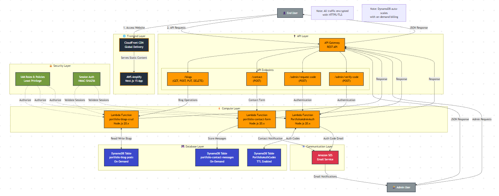

# Portfolio - Kirtankumar Thummar

> A modern, serverless full-stack portfolio website showcasing cloud-native architecture and DevOps expertise.

[](https://nextjs.org/)
[](https://reactjs.org/)
[](https://aws.amazon.com/)
[](https://www.typescriptlang.org/)
[](https://tailwindcss.com/)

---

## 👨‍💻 About Me

**Kirtankumar [K.K.] Thummar**  
Cloud-Native & DevOps Engineer

- **Email**: kirtanthummar.uni@gmail.com
- **Experience**: 3+ years in Cloud Engineering & DevOps
- **Achievements**: Built 10+ production repositories | 70% cloud cost reduction
- **Expertise**: AWS, Kubernetes, Terraform, CI/CD, Microservices Architecture

---

## 🌟 Project Overview

This portfolio website is a showcase of modern cloud-native development, featuring:

-  **Serverless Architecture** - Built entirely on AWS Lambda, DynamoDB, and API Gateway
-  **Dynamic Blog System** - Rich text editor with markdown support, reactions, and comments
-  **Secure Admin Panel** - Email-based authentication for content management
-  **Contact Form** - Integrated with Amazon SES for real-time notifications
-  **Hosted on AWS Amplify** - Continuous deployment with automatic builds
-  **High Performance** - Next.js 15 with Turbopack for blazing-fast development
-  **Modern UI** - Responsive design with Tailwind CSS v4

---

## 🏗️ AWS Architecture



### Architecture Highlights

- **Frontend**: Next.js 15 hosted on AWS Amplify with automatic CI/CD
- **API**: Amazon API Gateway with RESTful endpoints
- **Compute**: AWS Lambda (Node.js 20.x) - 3 serverless functions
- **Database**: DynamoDB with on-demand billing and TTL
- **Email**: Amazon SES for contact notifications and auth codes
- **Security**: IAM roles, session-based auth, CSRF protection

---

## 🚀 Quick Start

### Prerequisites

- Node.js 20+ (LTS)
- AWS CLI configured with credentials
- PowerShell 5.1+ (Windows) or PowerShell Core
- AWS account with appropriate permissions

### Installation

1. **Clone the repository**
   ```bash
   git clone https://github.com/VanGoghCode/cloud-portfolio.git
   cd cloud-portfolio
   ```

2. **Install dependencies**
   ```bash
   npm install
   ```

3. **Setup environment variables**
   ```bash
   npm run setup:env
   ```
   This creates `.env.local` with required AWS configuration.

4. **Deploy AWS infrastructure**
   ```bash
   npm run aws:deploy
   ```
   Deploys Lambda functions, DynamoDB tables, API Gateway, and configures SES.

5. **Verify email for SES** (check your inbox for verification link)

6. **Start development server**
   ```bash
   npm run dev
   ```
   Open [http://localhost:3000](http://localhost:3000) in your browser.

---

## 📦 Deployment to AWS Amplify

This project is deployed using AWS Amplify for continuous deployment:

1. **Connect GitHub repository** to AWS Amplify
2. **Build settings** (automatically detected):
   ```yaml
   version: 1
   frontend:
     phases:
       preBuild:
         commands:
           - npm install
       build:
         commands:
           - npm run build
     artifacts:
       baseDirectory: .next
       files:
         - '**/*'
     cache:
       paths:
         - node_modules/**/*
   ```
3. **Environment variables** - Add to Amplify Console:
   - `NEXT_PUBLIC_API_ENDPOINT`
   - `ADMIN_EMAIL`
   - `AWS_REGION`

4. **Custom domain** (optional) - Configure in Amplify Console

---

## 🛠️ Tech Stack

### Frontend
- **Framework**: Next.js 15.5 (App Router, Turbopack)
- **UI Library**: React 19.1
- **Styling**: Tailwind CSS v4
- **Language**: TypeScript 5.9
- **Icons**: React Icons
- **Rich Text**: TipTap Editor

### Backend (AWS)
- **Compute**: AWS Lambda (Node.js 20.x)
- **Database**: Amazon DynamoDB
- **API**: Amazon API Gateway (REST)
- **Email**: Amazon SES
- **Hosting**: AWS Amplify
- **Auth**: Session-based with HMAC-SHA256

### DevOps
- **IaC**: PowerShell scripts
- **CI/CD**: AWS Amplify
- **Monitoring**: CloudWatch Logs
- **Version Control**: Git/GitHub

---

## 📜 Available Scripts

| Command | Description |
|---------|-------------|
| `npm run dev` | Start development server with Turbopack |
| `npm run build` | Build production application |
| `npm start` | Start production server |
| `npm run lint` | Run ESLint |
| `npm run aws:deploy` | Deploy all AWS resources |
| `npm run aws:health` | Health check for AWS infrastructure |
| `npm run aws:seed` | Seed sample blog posts |
| `npm run setup:env` | Generate .env.local file |

---

## 📂 Project Structure

```
cloud-portfolio/
├── aws/                    # AWS infrastructure scripts
│   ├── lambda/            # Lambda function source code
│   └── *.ps1              # Deployment scripts
├── src/
│   ├── app/               # Next.js pages (App Router)
│   │   ├── admin/        # Admin panel & blog management
│   │   ├── blogs/        # Blog listing & posts
│   │   └── api/          # API route handlers
│   ├── components/        # Reusable React components
│   ├── hooks/            # Custom React hooks
│   └── lib/              # Utilities & API client
├── middleware.ts          # Route protection middleware
├── next.config.ts         # Next.js configuration
└── package.json           # Dependencies & scripts
```

---

## 🔐 Features

### 🏠 Portfolio Homepage
- Interactive hero section with animated tech icons
- About section with experience and skills
- Projects showcase with live demos
- Integrated contact form

### 📝 Blog System
- Create, edit, and delete blog posts
- Rich text editor with markdown support
- Search and tag filtering
- View counter and pagination
- Emoji reactions and comments

### 🔒 Admin Panel
- Secure email-based authentication
- Blog content management dashboard
- Real-time blog preview
- Session-based authorization

### 📧 Contact Form
- Email validation and spam protection
- AWS SES integration
- Success/error notifications
- Rate limiting

---

## 🔒 Security

- **Session-based Authentication** - HMAC-SHA256 signed tokens
- **CSRF Protection** - Token validation on state-changing operations
- **Rate Limiting** - IP and email-based limits on contact form
- **HttpOnly Cookies** - Secure session storage
- **Honeypot Fields** - Spam prevention
- **IAM Least Privilege** - Function-specific roles

---

## 📊 AWS Cost Optimization

- **DynamoDB**: On-demand billing (pay per request)
- **Lambda**: 256MB memory, 30s timeout (optimized for cost)
- **API Gateway**: REST API with efficient caching
- **Amplify**: Free tier for small projects
- **SES**: $0.10 per 1,000 emails (after free tier)

**Estimated Monthly Cost**: ~$5-10 for low traffic

---

## 🧪 Health Check

Verify AWS infrastructure status:

```bash
npm run aws:health
```

Checks:
- ✅ DynamoDB tables (active status)
- ✅ Lambda functions (deployment status)
- ✅ API Gateway endpoints
- ✅ SES email verification
- ✅ IAM role permissions

---

## 🤝 Contributing

This is a personal portfolio project, but feedback and suggestions are welcome!

1. Fork the repository
2. Create a feature branch (`git checkout -b feature/improvement`)
3. Commit changes (`git commit -m 'Add feature'`)
4. Push to branch (`git push origin feature/improvement`)
5. Open a Pull Request

---

## 📄 License

This project is private and proprietary. All rights reserved.

---

## 📞 Contact

**Kirtankumar Thummar**

- 📧 Email: kirtanthummar.uni@gmail.com
- 🌐 Portfolio: [vctrx.cloud](https://vctrx.cloud/)
- 💼 LinkedIn: [linkedin.com/in/kirtankumar-thummar](https://www.linkedin.com/in/kirtankumar-thummar/)
- 🐙 GitHub: [@VanGoghCode](https://github.com/VanGoghCode)

---

## 🙏 Acknowledgments

- Built with modern cloud-native technologies
- Inspired by serverless architecture best practices
- Designed for scalability and maintainability

---

<p align="center">
  <strong>Built with ☁️ by Kirtankumar Thummar</strong><br>
  <em>Cloud-Native & DevOps Engineer</em>
</p>

<p align="center">
  <sub>Last Updated: October 28, 2025</sub>
</p>
